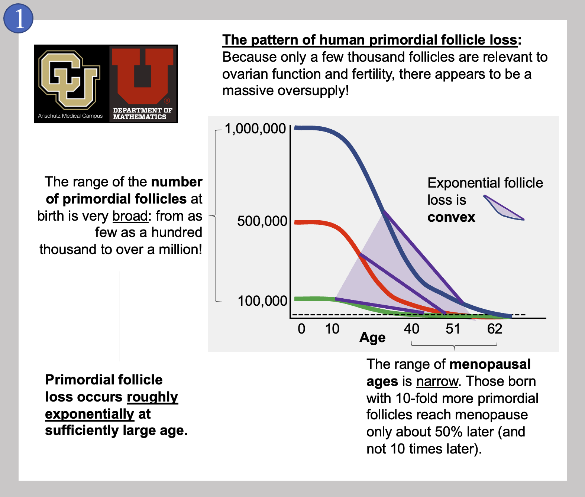
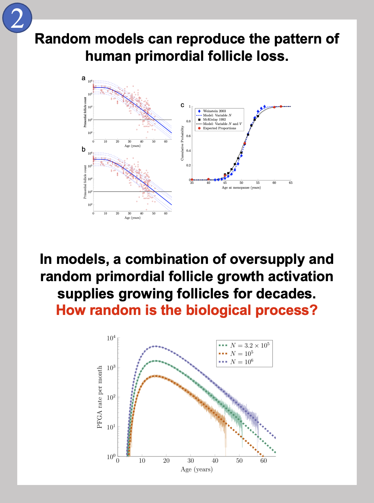
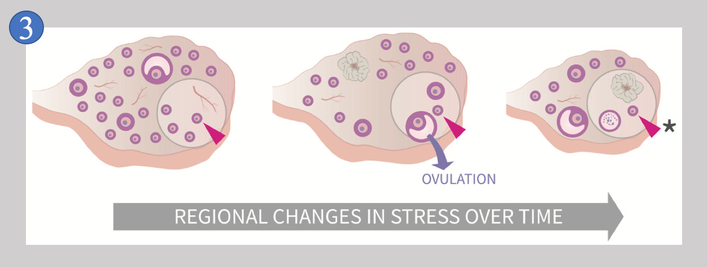
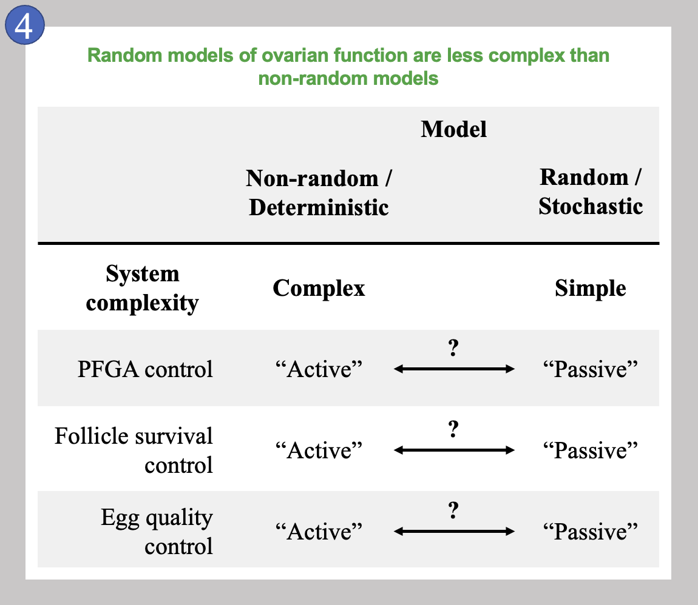

# How random is ovarian aging?

Post v1.0

November 4, 2022

**<a href = "mailto: joshua2.johnson@cuanschutz.edu">Josh Johnson, Ph.D.</a>**, University of Colorado School of Medicine, Department of Obstetrics and Gynecology

**<a href = "mailto: lawley@math.utah.edu">Sean Lawley, Ph.D.</a>**, University of Utah Department of Mathematics

## "Ovarian aging" is the loss of ovarian follicles over time

Ovarian aging depends upon the loss of immature ovarian follicles that contain egg cells (also called oocytes). When girls are born, their ovaries contain as many as a million of these immature *primordial* follicles, and these are used up over time as each begins to grow. Only about 500 follicles will ever release an egg during adult life, and these monthly ovulation events are the times when conception could occur. The rest of the many hundreds of thousands of eggs will die within their follicles slowly over time. When a woman has about 1000 follicles left, she reaches menopause, and menstrual cycles come to their end.

We have recently [published some evidence](https://doi.org/10.7717/peerj.13941) [1] that ovarian aging may depend upon random processes. By this we mean that the decision that individual primordial follicles make to begin to grow may be random. This was a surprise, even to us, as the decision to stay dormant or begin to grow is very important. If too many primordial follicles begin to grow, too quickly, a woman would run out of her egg cells too early. She might run out of egg cells so quickly that she would be incapable of conceiving a child very early in life. As we will discuss below, taking a look at the pattern of primordial follicle loss opens the door to the idea that this decision could actually be random.

In Image 1, we show the general pattern of human primordial follicle loss that takes place inside a woman's ovaries over time. As mentioned above, there are many more follicles present than will ever be used for reproduction. On top of the 500 or so follicles that could be used for reproduction, a few thousand more are needed to keep the ovary working. This is because ovarian follicles (that contain eggs) also produce the hormones needed to keep the reproductive system cycling. Having hundreds of thousands of follicles when only a few thousand are needed is referred to as the ovarian "oversupply" of follicles. This mystery of why the human ovary is so "wasteful" is mentioned by experts all the time.

It is also very interesting that the oversupply can be so different between newborn girls! Image 1 also shows that some girls are born with about one hundred thousand primordial follicles (green curve) while others are born with the mentioned million (blue curve). While it is not perfectly clear that women born with the most primordial follicles will always reach menopause the latest, this is what most attempts at modeling ovarian aging suggest. And even though some women have 10 times the number of primordial follicles, they do not reach menopause 10 times later. Instead, the range of menopausal ages in women is quite narrow, from about age 40 to just after age 60. Imagine instead if this range of menopausal ages was actually a factor of 10 - follicles might run out any time between the ages of nine and 90!

A last feature of the loss of primordial follicles is that the pattern is *convex*. In math, a curve is convex when a line drawn between two points on the curve is entirely above the curve itself. As shown by the purple lines, our follicle loss curves (blue, red, and green) all become convex early in life. A convex curve of loss over time like this means that follicle loss is always slowing down, or, [decelerating](https://scripts.mit.edu/~srayyan/PERwiki/index.php?title=Module_4_--_Graphing_Motion_and_Acceleration_vs._Deceleration). The later you look, the numbers of follicles lost per year or per month are **declining**. Because these patterns are occurring in actual girls and women over decades of their lives, it has been difficult to figure out how the pattern is controlled. Many excellent research studies have been published that show that certain signals inside the ovary can influence how quickly follicles are lost, and we consider some of these below within this post. For now...

### Here are the main questions we have been working on:

1. How is the behavior of individual primordial follicles controlled so that they begin to grow when they do? The overall pattern of loss (Image 1) is the result of how individual primordial follicles behave.  
1. What controls whether a follicle lives (0.1%) or dies (99.9%) after it begins to grow?
1. There are "good" eggs and "bad" eggs, and only good eggs can be fertilized and result in conception and the live birth of you and me. Maybe follicle survival is controlled by how "good" the egg inside is. It seems like an ovary would like to make sure that the best eggs survive and get ovulated for attempts at conception! Do follicles use a "quality control" strategy to keep follicles with the best eggs alive, and allow follicles with bad eggs to die?

It's not just us - many researchers have been interested in these questions for many years.

## Follicle loss and radioactive decay?

The pattern of follicle loss was revealed by counting follicles in ovary specimens at different ages. It may surprise you to hear that more than thirty years ago, several groups reported that the pattern(s) of ovarian follicle loss in women is exponential [2-5], and some authors noted that this is very similar to the pattern seen in spontaneous, random [radioactive decay of materials](https://www.cdc.gov/nceh/radiation/isotopes.html#:~:text=Radioactive%20decay%20is%20the%20process,the%20radiation%20it%20gives%20off.) [6,7]! Some of these groups were collaborations between biology researchers and mathematicians, just like our collaboration.

Radioactive decay can be accurately described and predicted by mathematical formulas for the random behavior of particles. The earlier ovary research teams noted that the very same formulas could be used to accurately describe the pattern of follicle loss, and to even predict how quickly follicle loss might occur over time.
We can't speak for those research groups, but we suspect that it was one thing to realize that follicle loss and radioactive decay followed the same patterns, but quite another to suspect that primordial follicles behave randomly...literally. It is a little unsettling to think that these precious structures, the follicles that contain the eggs needed to give rise to mammals like us, behave randomly! The idea that this critical behavior of follicles, inside the critical ovary, could be "left to the fates" could be described as shocking, foreign, even bizarre. At minimum, it's surprising. Even if the decision for primordial follicles to begin to grow *was* random like radioactive decay, how would this be controlled biologically?

In 2021, a project in one of our labs was wrapping up a study where we showed that a biological pathway, the [Integrated Stress Response](https://doi.org/10.15252/embr.201642195), is activated under normal circumstances in primordial follicles. [Our published work](https://doi.org/10.1093/molehr/gaab050) [8] led by at-the-time Ph.D. student Evelyn Llerena Cari included the new hypothesis that (literal) random action dictates which primordial follicles begin to grow over time. Summarized briefly, we knew that the Integrated Response Pathway normally keeps cells from growing when activated. If the pathway becomes *inactivated* rarely and randomly in primordial follicles, it would explain why follicles begin to grow rarely and randomly, and remarkably, would match the pattern of primordial follicle loss that we see.

Soon after that, we started to collaborate and used our combined ovary biology and mathematical expertise, along with [Jay Emerson](http://www.stat.yale.edu/~jay/) of the Yale University Department of Statistics and Data Science. We started with our first question, "How is the behavior of individual primordial follicles controlled...?" We used both formal mathematics and [computer simulations](https://figshare.com/articles/software/R_files_and_Primordial_Follicle_Dataset/19858987), and found something startling.

If random action in primordial follicles is taken literally, and follicles are treated if the decision to grow occurs randomly, the natural pattern of follicle loss in individual girls and women can be produced! This is shown in the top panel in Image 2, and clicking on that image will again take you to [our published manuscript](https://doi.org/10.7717/peerj.13941) [1], out in August of 2022. As a side-note, you may notice that the shapes of the curves in Image 2's top panels a and b (the publication's Figure 2) are different from the convex shape of the curves in Image 1 in this blog post. This is because the plots in the paper make use of a logarithmic scale, while the image in this post is on a linear scale; they are showing the same pattern, but the exponential decay is easier to see when a linear scale is used as above. It was even more startling at the time to show that when many simulations were run of girls who were "born" with different numbers of primordial follicles, keeping track of the times that they later reached menopause resulted in the actual times that women reach menopause! Under the random simulation conditions, very few women reach menopause prior to age 40, the median age of menopause was 51, and (almost) no women reach menopause after age 62. So, random action of primordial follicles can reproduce the correct patterns of ovarian aging in individuals and also in populations of individuals.

We have followed this up with some unpublished work showing that the high numbers of primordial follicles (hundreds of thousands to a million), in combination with random action, can lead to a predictable supply of growing follicles for decades; this is shown in the bottom panel in Image 2. This part of our project might help to explain the "oversupply" and seeming "wastefulness" of the human ovary that we mentioned at the beginning!

All of our math results in combination with our Integrated Stress Response data are exciting and help us describe how follicle loss might be occurring. However, this major question still remains:
## 
How random is the biological process of primordial follicle loss **really**?

Our work in this area is exciting and consistent with prior studies. From our standpoint, our main new contribution to the area is connecting random action with a biological mechanism, the Integrated Stress Response. In some ways it is still hard to believe that random processes really control primordial follicles. Clarifying what we mean when we say "non-random" and "random" is helpful here, so let's review these options.

First, "non-random" control of the behavior of primordial follicles might be described as regulated, controlled, deterministic, planned, organized, orchestrated, managed, or coordinated. These words very accurately describe what happens in many organs and biological systems, for example the control of our resting heart rate, or blood pressure. We can add that "non-random" control might be global throughout an organ where a process is controlled at a larger scale. In the ovaries, this would mean that physiological signals produced throughout the ovary would control whether individual primordial follicles stay dormant or begin to grow in a "top-down" manner. This global control mechanism in the ovary would function to ensure that follicles are not lost too quickly or too slowly.

In contrast, "random" behavior within a population of follicles (or a population of radioactive atoms), means that the pattern of their growth events is predictable, even if we cannot predict which of the many primordial follicles will be the next one to grow. Here, no regulated, coordinated mechanisms are needed. This does not mean that local signals cannot influence the decisions of individual primordial follicles, it just means that important local signals appear to come and go quite randomly.

It is clear that something like random local conditions occur within the ovary, and that these local conditions change over time. The ovary is a unique organ compared to all others due to the loss of follicles over time, and the growth and death of follicles that occur throughout life. This means that unlike our other organs (and indeed unlike any organ in males), the ovary is always changing. We enjoy referring to this as ["Everything Everywhere All At Once"](https://a24films.com/films/everything-everywhere-all-at-once) happening for follicles within the ovary.

Due to this behavior, no two ovaries are ever exactly alike, and no single ovary is the same at two different times. [Follicles growing and dying throughout the ovary over time](https://doi.org/10.7717/peerj.13941) means that an individual follicle like the one indicated by the red arrowhead in Image 3

experiences "REGIONAL CHANGES IN STRESS OVER TIME" (image from [1]). It is this unique feature of the ovary that we suspect is inducing random conditions (of stress) upon primordial follicles, and we suspect that these changing conditions make the decision to stay dormant or begin to grow quite random. But why do this? There is a big advantage when randomness is part of the control of primordial follicle behavior that we have yet to discuss, and that is the point that a system that depends upon random action is much less complex than a system that lacks random action.

## Simple versus complex

The table in Image 4 is a summary of how complex the control of follicle behavior might be if randomness is or is not involved. We compare how complex primordial follicle growth activation (PFGA) control, growing follicle survival control, and the monitoring of egg quality control would be if these are either *not* random (and are instead Deterministic), or involve at least some randomness (Stochastic).

As mentioned above, we favor the possibility that random processes combine with some non-random signaling to give rise to the pattern of primordial follicle loss. In the table, entirely non-random PFGA control would be the most complex mechanism, as specific signals would need to be produced at exactly the right times, in exactly the right amounts to signal individual primordial follicles to begin to grow. Conversely, an entirely random  mechanism would be as simple as possible as no specific signals would need to be produced upon any schedule. Instead, the decision that individual follicles make to begin to grow would be entirely "Passive" and would occur only in response to changing local conditions as shown in Image 3. Note that the arrows labeled with question marks mean again that any of these processes could involve both random and non-random processes; the more non-random, the more complex.

All of these features would also be true for the other two processes considered, and nearly identically true for follicle survival control. Egg quality control is interesting to consider on its own, because it is possible that this specific process is entirely "Passive," meaning that there is no actual monitoring of whether an egg is good or bad. If a follicle survives, the egg inside is either good, or bad, and this would be the most simple mechanism possible. Here again, this is outside of the scope of this post, and worthy of a great deal more exploration. Suffice it to say, that there is actually very little evidence that egg quality control is an active/Non-random/Deterministic process. These ideas considered as a comparison between simple versus complex mechanisms lead us to our last concepts, the cradle and the gauntlet.

## The cradle versus the gauntlet

Wrapping up here, we again consider a complex, non-random system with specific signals that control follicle growth, survival, and egg quality. We call this model of the ovary and ovarian aging a "cradle" as it consists of mechanisms that carefully protect and manage the behavior of follicles. This model is very satisfying, as it seems to maximize protecting its precious follicle and egg contents, and to ensure that selecting the best eggs is the highest priority. The cradle is the first option above, and would depend mostly on non-random, deterministic mechanisms. The cradle would seem to require elaborate intra-ovary and inter-follicle communication. In the cradle, many checkpoints, and many genes involved in cellular repair could cooperate in order to produce the patterns of follicle behavior that we see. We first mentioned the contrasting "gauntlet" model in our study of the Integrated Stress Response [8], and we quote that paper here:

>"A model that includes an active ISR as the default for ovarian follicles implies an internal ‘quality control’ mechanism...A counterintuitive hypothesis is raised where mammalian ovaries may use physiological activation of the ISR to control [primordial follicle growth patterns]. This same mechanism would influence which follicles survive and which die, and, thus, the overall rate of female reproductive aging...This model suggests that the ovary [may] function as a ‘gauntlet’, where physiological factors that activate the ISR and favor DNA damage act ultimately to select follicles for survival that are capable of resolving that stress and damage."

Stated plainly, a follicle that survives "[running the gauntlet](https://www.youtube.com/watch?v=fLnkCAFihqA)" of stress and damage has proven that it is tough enough to survive difficult conditions, possibly for many years. The idea of the gauntlet is definitely counterintuitive, and maybe less satisfying at first glance in comparison to a protective, nurturing cradle. The gauntlet does have the built-in advantage of simplicity, where growth, survival, and egg quality control are all by-products of random action, and the ability of follicles to survive. The gauntlet model may overlap with some complex mechanisms invoked by the cradle, but the less it does so, the more simple the system would be (Image 4).

## Male and female randomness

A last thing to remember is that the male side of human reproduction is also marked by vast "wastefulness" and redundancy. We considered above that a girl might be born with as many as one million egg cells in her ovaries, a large number that will last for decades. However, around <!--108--> one **hundred** million sperm cells are released to search for the egg after a single bout of intercourse, even though only one sperm cell can fertilize the ovulated egg [9]. The testis' production of sperm is incredibly prolific to be able to support these numbers, and it is easy to accept this wastefulness because sperm need to swim and survive within the female reproductive tract. It is also easy to accept that the more sperm cells delivered, the *faster* the first outlier sperm cell will find the egg. The reason, then, to deliver enormous numbers of sperm is that it is a way to "accelerate the search process," accelerating what is called the mathematical *fastest first passage time* [10-12].

In the ovary, the number of eggs is smaller and the time scale is longer, and the system needs just one follicle to survive and produce a mature egg every month. Some of the excess growing follicles will produce hormones, but as mentioned, all of these excess growing follicles will die. If the random processes we discussed here contribute to their decision to grow or stay dormant, having large numbers of extra primordial follicles ensures that the outlier last follicles that begin to grow allow the ovaries to function for decades. Here, having large numbers of follicles decelerates the mathematical *slowest first passage time*. This is consistent with the idea that the more follicles present at birth, the *later* the last follicles will begin to grow. Remarkably, this may help to explain why follicle "oversupply" occurs in human females [13].

## Some last thoughts

We have been quite surprised several times during our investigations of ovarian aging and follicle behavior, and there is a lot of exciting work left to do in this area. Progress is being made right now by several groups on the biological mechanisms that control the number of primordial follicles produced during fetal life that then control their number in the ovaries at the time of birth. These mechanisms appear to be critically important in determining when that newborn girl will reach menopause decades later! There are surely more surprises to come, and it is exciting to consider just how random primordial follicle behavior and ovarian aging really are! Instead of our mothers' ovaries working hard to select the best eggs, we might all be here due to a random selection of eggs that were just good enough to do the job.

## REFERENCES

[1] [J Johnson, JW Emerson, and SD Lawley. Recapitulating human ovarian aging using random walks. PeerJ, 10:e13941, 2022.](https://doi.org/10.7717/peerj.13941)

[2] [MJ Faddy, RG Gosden, A Gougeon, SJ Richardson, and JF Nelson. Accelerated disappearance of ovarian follicles in mid-life: implications for forecasting menopause. Human Reproduction, 7(10):1342–1346, 1992.](https://doi.org/10.1093/oxfordjournals.humrep.a137570)

[3] [MJ Faddy and RG Gosden. Ovary and ovulation: a model conforming the decline in follicle numbers to the age of menopause in women. Human Reproduction, 11(7):1484–1486, 1996.](https://doi.org/10.1093/oxfordjournals.humrep.a019422)

[4] [KR Hansen, NS Knowlton, AC Thyer, JS Charleston, MR Soules, and NA Klein. A new model of reproductive aging: the decline in ovarian non-growing follicle number from birth to menopause. Human Reproduction, 23(3):699–708, 2008.](https://doi.org/10.1093/humrep/dem408)

[5] [WHB Wallace and TW Kelsey. Human ovarian reserve from conception to the menopause. PloS one, 5(1):e8772, 2010.](https://doi.org/10.1371/journal.pone.0008772)

[6] [AN Hirshfield. Development of follicles in the mammalian ovary. International review of cytology, 124:43–101, 1991.](https://doi.org/10.1016/s0074-7696(08)61524-7)

[7] [CE Finch and TBL Kirkwood. Chance, development, and aging. Oxford University Press, USA, 2000.](https://api.semanticscholar.org/CorpusID:117739759)

[6] [E Llerena Cari, S Hagen-Lillevik, A Giornazi, M Post, L Appiah, B Bitler, AJ Polotsky, N Santoro, J Kieft, K Lai, and J Johnson. Integrated stress response control of granulosa cell translation and proliferation during normal ovarian follicle development. Molecular Human Reproduction, 27(8), 2021.](https://doi.org/10.1093/molehr/gaab050)

[7] [M Eisenbach and LC Giojalas. Sperm guidance in mammals - an unpaved road to the egg. Nature Reviews Molecular Cell Biology, 7(4):276, 2006.](https://doi.org/10.1038/nrm1893)

[8] [B Meerson and S Redner. Mortality, redundancy, and diversity in stochastic search. Phys Rev Lett, 114(19):198101, 2015.](https://doi.org/10.1103/physrevlett.114.198101)

[9] [SD Lawley. Universal formula for extreme first passage statistics of diffusion. Phys Rev E, 101(1):012413, 2020.](https://doi.org/10.1103/physreve.101.012413)

[10] [SD Lawley. Distribution of extreme first passage times of diffusion. Journal of Mathematical Biology, 2020.](https://doi.org/10.1007/s00285-020-01496-9)

[11] SD Lawley and J Johnson. Why is there an “oversupply” of human ovarian follicles? *Manuscript under peer review*.

<!-- Google tag (gtag.js) -->

